# How to demo Modernized Runtime Extension for Java End-to-End

## Objectives

In this exercise, you will learn how developers can use watsonx Code Assistant with VS Code Integrated Development Environment for modernizing an existing Java Enterprise Application. 

At the end of this lab, you should be able to:

  - use Application Modernization Accelerator (AMA) to assess an application for target Modernized Runtime Extensions for Java (MoRE)
  - use Application Modernization Accelerator Development Tools (AMA Dev Tools) to modernize the application to make it work on MoRE
  - create within a traditional WebSphere Application Cell a managed Liberty cluster and deploy the modernized application
  
The lab consists of two parts:

- Part 1: AMA - Analyze the application WhereAmI using AMA and modernize it using the AMA Dev Tools
- Part 2: MoRE - Create in MoRE a managed Liberty cluster and deploy the application

You will need an estimated **60 to 90 minutes** to complete all parts of the lab.
After the lab setup, you will be able to skip part 1 (AMA) and move directly to part 2 (MoRE).

## Notices and disclaimers

© 2025 International Business Machines Corporation. No part of this document may be reproduced or transmitted in any form without written permission from IBM.

© 2025 International Business Machines Corporation. No part of this document may be reproduced or transmitted in any form without written permission from IBM.

**U.S. Government Users Restricted Rights — use, duplication or disclosure restricted by GSA ADP Schedule Contract with IBM.**

This document is current as of the initial date of publication and may be changed by IBM at any time. Not all offerings are available in every country in which IBM operates.

Information in these presentations (including information relating to products that have not yet been announced by IBM) has been reviewed for accuracy as of the date of initial publication and could include unintentional technical or typographical errors. IBM shall have no responsibility to update this information. 

**This document is distributed “as is” without any warranty, either express or implied. In no event, shall IBM be liable for any damage arising from the use of this information, including but not limited to, loss of data, business interruption, loss of profit or loss of opportunity.** IBM products and services are warranted per the terms and conditions of the agreements under which they are provided. The performance data and client examples cited are presented for illustrative purposes only. Actual performance results may vary depending on specific configurations and operating conditions.

IBM products are manufactured from new parts or new and used parts. 
In some cases, a product may not be new and may have been previously installed. Regardless, our warranty terms apply.”

**Any statements regarding IBM's future direction, intent or product plans are subject to change or withdrawal without notice.**

Performance data contained herein was generally obtained in a controlled, isolated environments. Customer examples are presented as illustrations of how those customers have used IBM products and the results they may have achieved. Actual performance, cost, savings or other results in other operating environments may vary. 

References in this document to IBM products, programs, or services does not imply that IBM intends to make such products, programs or services available in all countries in which IBM operates or does business. 

Workshops, sessions and associated materials may have been prepared by independent session speakers, and do not necessarily reflect the views of IBM. All materials and discussions are provided for informational purposes only, and are neither intended to, nor shall constitute legal or other guidance or advice to any individual participant or their specific situation.

It is the customer’s responsibility to ensure its own compliance with legal requirements and to obtain advice of competent legal counsel as to the identification and interpretation of any relevant laws and regulatory requirements that may affect the customer’s business and any actions the customer may need to take to comply with such laws. IBM does not provide legal advice or represent or warrant that its services or products will ensure that the customer follows any law.

Questions on the capabilities of non-IBM products should be addressed to the suppliers of those products. IBM does not warrant the quality of any third-party products, or the ability of any such third-party products to interoperate with IBM’s products. **IBM expressly disclaims all warranties, expressed or implied, including but not limited to, the implied warranties of merchantability and fitness for a purpose.**

The provision of the information contained herein is not intended to, and does not, grant any right or license under any IBM patents, copyrights, trademarks or other intellectual property right.

IBM, the IBM logo, and ibm.com are trademarks of International Business Machines Corporation, registered in many jurisdictions worldwide. Other product and service names might be trademarks of IBM or other companies. A current list of IBM trademarks is available on the Web at “Copyright and trademark information” at
[Learn more →](https://www.ibm.com/legal/copyright-trademark)

## Lab requirements

The section contains details about the environment.
If you use the lab environment that we prepared for this lab. It already has the prerequisite software installed and configured.

### Required software
To perform the exercise, the following software is required:
- Java 17 or Java 21
- Maven 
- Git (Optional but recommended:)
- IBM Application Modermnization Accelerator
- Visual Studio Code
- Visual Studio Code extensions
    - IBM Application Modermnization Accelerator Development Tools
    - Liberty Tools

### Connectivity
Internet access is required to download artefacts from the maven repository.

## Introduction

MoRE provides the capability to continue using traditional WebSphere Application Server (tWAS) Operational Model to manage Java 17 and Java 8 applications within the same traditional WebSphere administrative environment.

<kbd></kbd>

In this lab, you will extend an existing WebSphere ND Cell, using the MoRE feature pak, for managed Liberty servers to manage and run Java 17 / Jakarta EE 10 (subset) applications using the familiar WebSphere administrative mode and admin console.

The final MoRE cell looks like in the diagram below, it will be fronted by an IBM HTTP Server for load distribution.

<kbd></kbd>

## Accessing and using the lab environment

How to use the lab environment

### Accessing the lab environment

If you are doing this lab as part of an instructor led workshop (virtual or face to face), an environment has already been provisioned for you. The instructor will provide the details for accessing the lab environment.

Otherwise, you will need to reserve an environment for the lab. You can obtain one here. Follow the on-screen instructions for the “**Reserve now**” option.

<https://techzone.ibm.com/my/reservations/create/685d6521be320b834e0e117d>

 The lab environment contains one (1) Linux VM, named **Workstation**.

  
    
  The Linux **Workstation** VM has the following software installed for the lab:
  
  - Maven 3.6.0 
  - IBM Semeru Runtime Open Edition 17.0.8.1
  - Visual Studio Code 1.95.2
    - Liberty Tools Plugin
    - watsonx Code Assistant plugins for Core and Enterprise Java
   

1. Access the lab environment from your web browser. 
    
    A `Published Service` is configured to provide access to the **Workstation** VM through the noVNC interface for the lab environment.
    
    a. When the demo environment is provisioned, click on the **environment tile** to open its details view. 

    b. Click on the **Published Service** link which will display a **Directory listing**  
    
    c. Click on the **"vnc.html"** link to open the lab environment through the **noVNC** interface. 
    
    
    
    d. Click the **Connect** button 
    
      

    e. Enter the password as:  **`IBMDem0s!`**. Then click the **`Send Credentials`** button to access the lab environment. 

    > Note: That is a numeric zero in IBMDem0s!  

      <kbd></kbd>

	 
	  

2. If prompted to Login to the "workstation" VM, use the credentials below: 

    The login credentials for the **workstation”** VM is:
 
     - User ID: **techzone**

     - Password: **IBMDem0s!**

     > Note: That is a numeric zero in the password

	  
 
     <kbd></kbd>
	 
	  
	
3.  Once you access the **Student VM** through the published service, you will see the Desktop, which contains all the programs that you will be using (browsers, terminal, etc.)

   

|         |           |  
| ------------- |:-------------|
|    | 
<strong>IMPORTANT:</strong>

Using the lab environment provided, all the required VS code extensions and dependencies have been installed for you.

This allows you to focus on the value of using the capabilities of the tools for fast, efficient inner-loop development, test, debug, of Java based applications and Microservices using Open Liberty in dev mode.

 |
   

### Tips for working in the lab environment     

1. You can resize the viewable area using the **noVNC Settings** options to resize the virtual desktop to fit your screen.

    a. From the environment VM, click on the **twisty** on the noNC control pane to open the menu.  

    

    b. To increase the visible area, click on `Settings > Scaling Mode` and set the value to `Remote Resizing`
      
     

2.  You can copy / paste text from the lab guide into the lab environment using the clipboard in the noVNC viewer. 
   
    a. Copy the text from the lab guide that you want to paste into the lab environment
    
    b. Click the **Clipboard** icon and **paste** the text into the noVNC clipboard

    
    
    c. Paste the text into the VM, such as to a terminal window, browser window, etc. 

    d. Click on the **clipboard** icon again to close the clipboard

    > **NOTE:** Sometimes pasting into a Terminal window in the VM does not work consistently. 
    
    > In this case you might try again, or open another Terminal Window and try again, or  paste the text into a **Text Editor** in the VM, and then paste it into the Terminal window in the VM. 

3. An alternative to using the noVNC Copy / Paste option, you may consider opening the lab guide in a web browser inside of the VM. Using this method, you can easily copy / paste text from the lab guide without having to use the noVNC clipboard. 

   

4. Click on the **Activities** icon within the VM to switch between different windows or get access the tool bar.
    <kbd></kbd>

    You will see the toolbar.

    <kbd></kbd>
    
     

|         |           |  
| ------------- |:-------------|
|    | 
<strong>Important:</strong> 
<strong>Click CANCEL</strong>…. If, at any time during the lab, you get a pop-up asking to install updated software onto the VM.
 
The one we experience is an update available for VS Code.

<strong>CLICK CANCEL!</strong>

 |

## Preparation:

 Download and build the application> 

### Prepare and build the maven project

1.  **Close** all **Terminal** windows and **Browser** Tabs used in any previous lab.

2.  Use the **Activities** Icon to switch to the toolbar, then click the **Terminal** icon to open a Terminal window.

    <kbd></kbd>

3. Create a working directory and download the project

		mkdir -p ~/Student/labs
		git clone https://github.com/LarsBesselmann/MoRE_WhereAMI_lab.git ~/Student/labs

4. Switch to the directory WhereAmI_MoRE_Demo_assets and uzip the initial project

		cd ~/Student/labs/WhereAmI_MoRE_Demo_assets
		unzip WhereAmI-2.0.0-Project.zip

5. Switch to the WhereAmI directory 

		cd WhereAmI

6. As the WhereAmI project depends on was_public.jar, you must make it visible to maven to avoid build failures. Run the following command 

   	    mvn install:install-file -Dfile=./was_dependency/was_public.jar -DpomFile=./was_dependency/was_public-9.0.0.pom

    You should see a success message.

7. Build the application with maven

		mvn clean
		mvn package

	The generated war file is: target/WhereAmI-2.0.0.war

 Prepare the MoRE cell> 

### Prepare the MoRE cell and deploy the application

1. Start the Dmgr and the two Node agents

		~/IBM/WebSphere/AppServer/profiles/Dmgr01/bin/startManager.sh 
		~/IBM/WebSphere/AppServer/profiles/AppSrv01/bin/startNode.sh
		~/IBM/WebSphere/AppServer/profiles/AppSrv02/bin/startNode.sh

	Wait until the Deployment Manager und the Node Agents have been started successfully.

2. Use wsadmin to create a tWAS cluster called tWASCluster1 and two members (tWASMember1, tWASMember2), one on each node.

		~/IBM/WebSphere/AppServer/profiles/Dmgr01/bin/wsadmin.sh -lang jython -user techzone -password IBMDem0s! -f ~/Student/labs/WhereAmI_MoRE_Demo_assets/setupScripts/tWASCluster_create.py 

3. Use wsadmin to install the generated application war to the tWAS cluster. During installation, adjust the context root to **/tWAS**.

		~/IBM/WebSphere/AppServer/profiles/Dmgr01/bin/wsadmin.sh -lang jython -user techzone -password IBMDem0s! -f ~/Student/labs/WhereAmI_MoRE_Demo_assets/setupScripts/tWASCluster_WhereAmI_install.py 

4. 	 Use the **Activities** Icon to switch to the toolbar, then click the **Firefox** icon to open a Browser window.

   	 <kbd></kbd>

5. Access via browser the WebSphere Admin Console via URL: https://localhost:9043/ibm/console.

	If a security warning is displayed, click on **Advanced**, then click on **Accept the Risk and Continue**. 

	<kbd>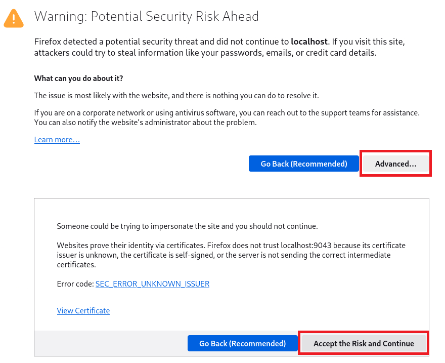</kbd>

6. On the **WAS Login panel**, enter User ID: techzone, password: **IBMDem0s!**

	<kbd>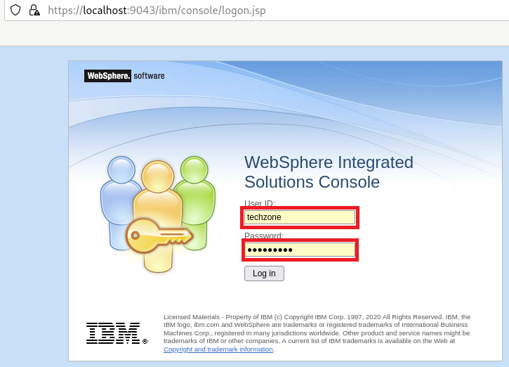</kbd>

7. Enable the command assistance

	From the Admin Console, set the console preferences to enable command assistance and log command assistance. This will allow to see the wsadmin commands for UI driven tasks.

	1. Navigate to **System administration > Console preferences**
	2. Select the following options:

			Enable command assistance notifications
			Log command assistance commands

		<kbd>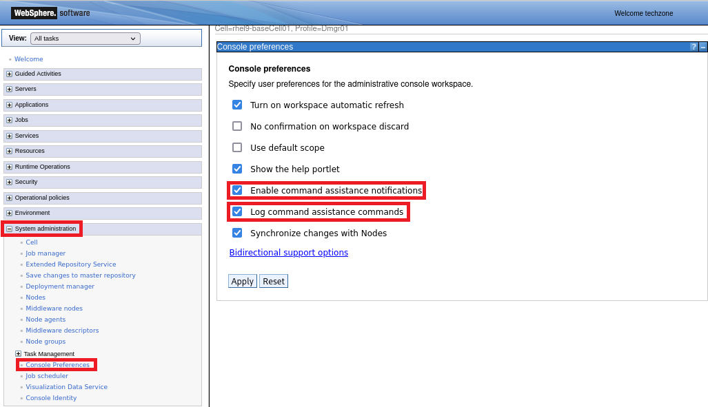</kbd>

8. Start the cluster tWASCluster1

	1. Navigate to **Servers > Clusters > WebSphere application server clusters**, select the cluster and click on **Start**.

	<kbd>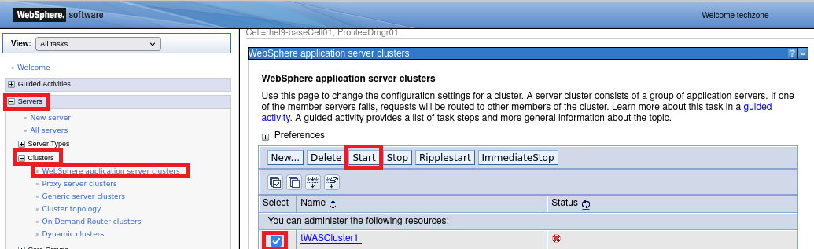</kbd>

	Alternatively you can run the following script:

		~/IBM/WebSphere/AppServer/profiles/Dmgr01/bin/wsadmin.sh -lang jython -user techzone -password IBMDem0s! -f ~/Student/labs/WhereAmI_MoRE_Demo_assets/setupScripts/tWASCluster_start.py 

7. Verify that the application has been started.

	1. Navigate to **Applications > Application Types > WebSphere enterprise applications**. The WhereAmI-2.0.0.war application should be running.

	<kbd></kbd>

	Click on the application **WhereAmI-2.0.0.war**, then click on **Manmage Modules**.

	<kbd>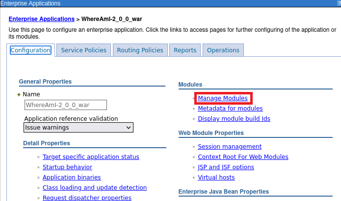</kbd>

	Verify that the application is mapped to webserver1 and tWASCluster1.

	<kbd></kbd>

8. Start the IBM HTTP Server via command

		/home/techzone/IBM/HTTPServer/bin/apachectl start

9. Access the application via browser on the IBM HTTP Server URL: http://localhost:8080/tWAS/WhereAmI.  

	<kbd></kbd>

10. Reload the page 

	<kbd>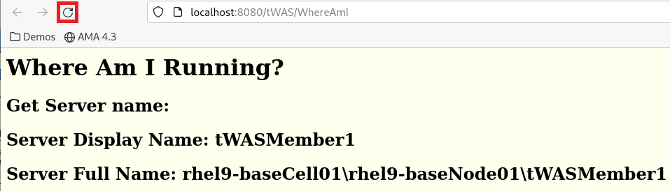</kbd>

	You should see that the application switches to the second tWAS servers.

	<kbd></kbd>

 Run the Application Modernization Accelerator data collector 

## Run the AMA data collector to scan the environment 

1. Start AMA

		cd ~/application-modernization-accelerator-local-4.3.0/
		scripts/startLocal.sh 

	Wait until AMA has started successfully and the URL is displayed.

	<kbd>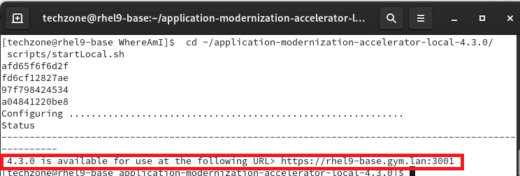</kbd>

2. Open a browser and access AMA via the URL https://rhel9-base.gym.lan:3001

3. In AMA, click on **Create workspace** and enter as name **MoRE_Demo**, then click on **Create**.

	<kbd>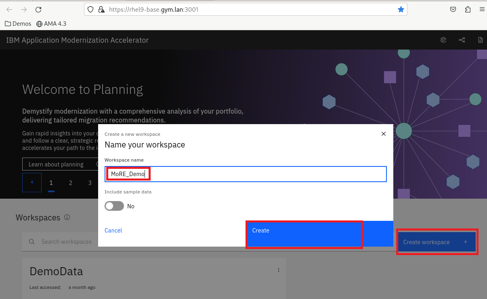</kbd>

4. Download the data collector

	1. Click on **Open discovery tool**

		<kbd>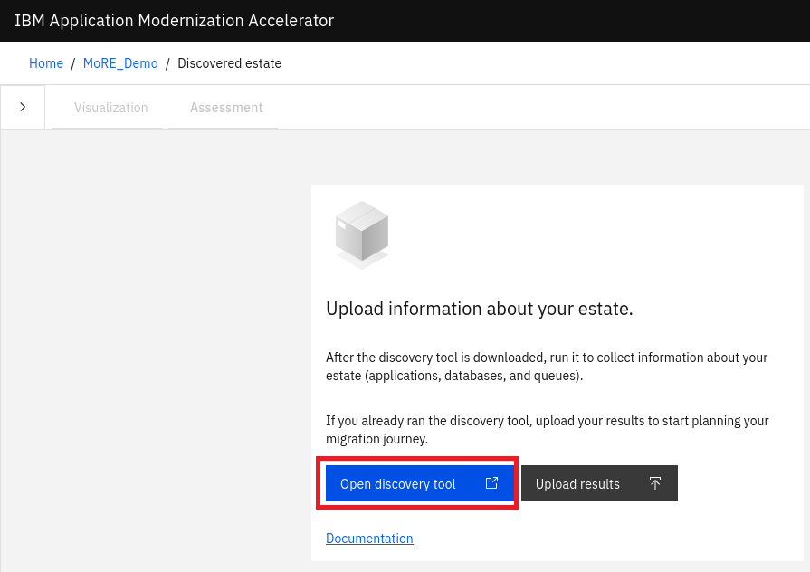</kbd>
	
	
	2. Click on **Download discovery tool** to download the data collector

		<kbd>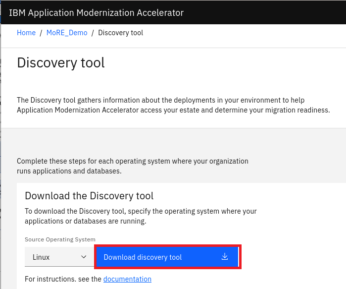</kbd>

		If a security warning is displayed, click on **Advanced**, then click on **Accept the Risk and Continue**. 

		<kbd>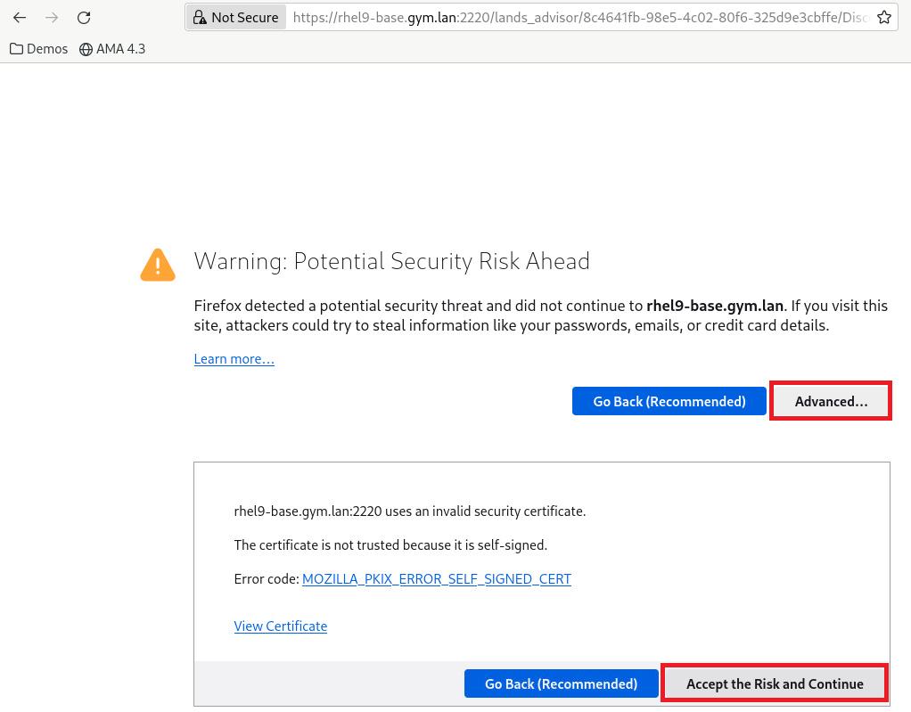</kbd>
	
		After some seconds, you will see a notification that the discovery tool has been downloaded.

		<kbd>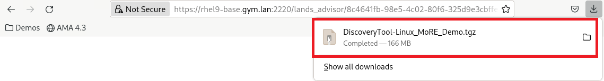</kbd>

	3. Click on the **back** button to return to the AMA Discovery Tool page

		<kbd>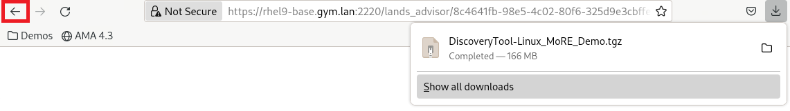</kbd>
		
	
5. Run the data collector to create a data collection and upload it.
	
	1. Extract the data collector

			cd ~/Downloads
			tar -zxvf DiscoveryTool-Linux_MoRE_Demo.tgz

	2. Start the data collector against the MoRE cell via command

			cd ~/Downloads
			transformationadvisor-4.3.0/bin/transformationadvisor -w /home/techzone/IBM/WebSphere/AppServer/
		
	3. Enter **1** to **Accept the license agreement** when asked to do so.

		<kbd>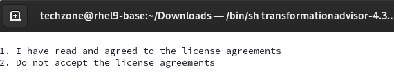</kbd>
		

	4. Wait until the collection has been uploaded and is available in AMA.

		<kbd>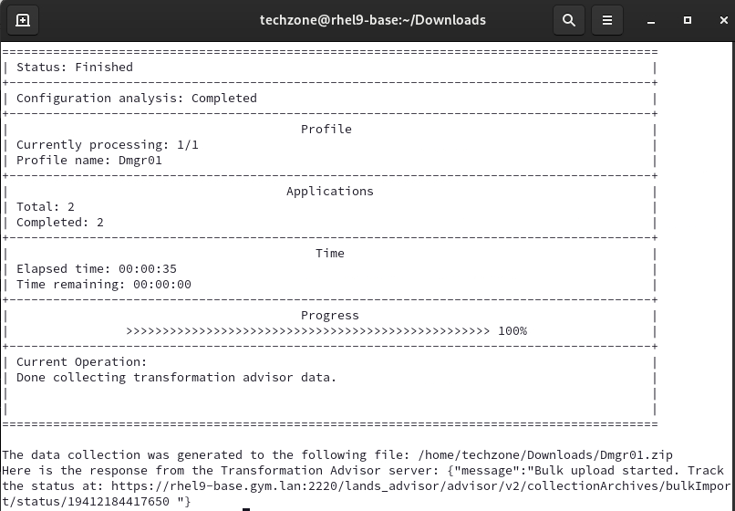</kbd>
		
	Hint: As backup, you can find a data collection named **Dmgr01.zip** also at 
		**~/Student/labs/WhereAmI_MoRE_Demo_assets/AMA_Collection/**

 Use the Application Modernization Accelerator to analyze the application 

### Use AMA to identify what needs to be changed to modernize the application for MoRE

1. Switch back to the browser and open the **MoRE_Demo** workspace.

	<kbd>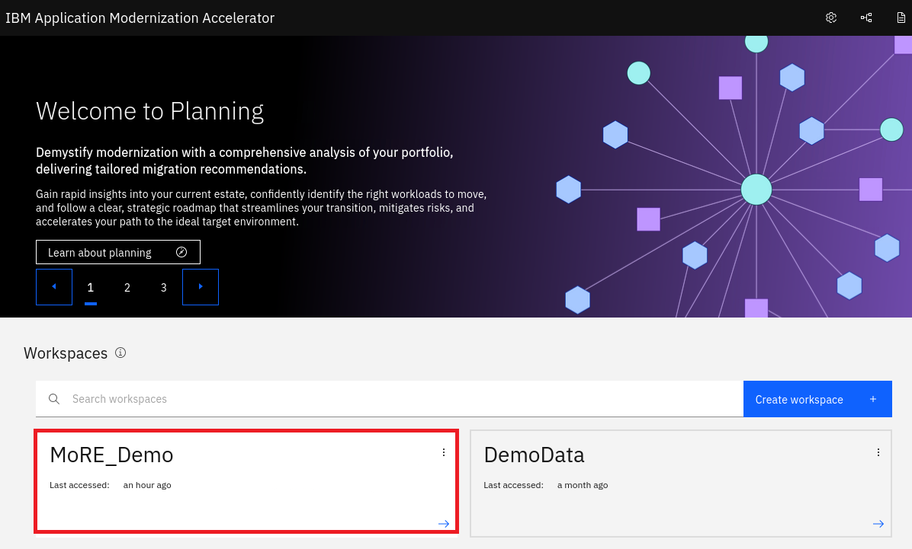</kbd>

2. The data collection should have been uploaded automatically. If you instead are asked to upload information about your estate, click on **Upload results**.  

	<kbd>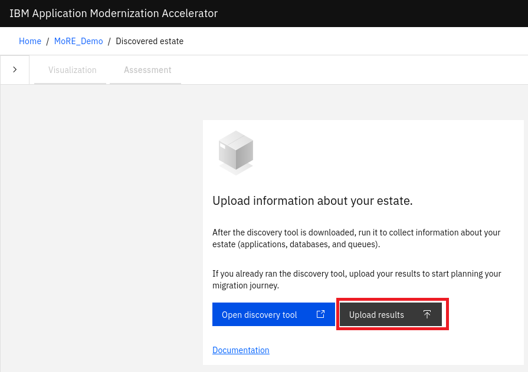</kbd>

	Then click on **Drag and drop files here or click to upload**,  

	<kbd>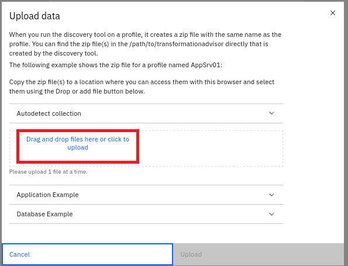</kbd>

	Select the file **/home/techzone/Student/labs/WhereAmI_MoRE_Demo_assets/AMA_Collection/Dmgr01.zip** and click on **Open**

	<kbd></kbd>

	Finally click on **Upload**

	<kbd>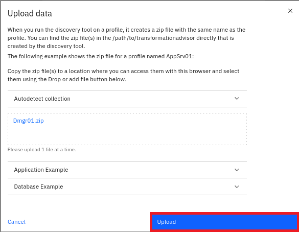</kbd>

2. AMA will open the **Visualization** tab. Click on the button to close the minimap. 

	<kbd></kbd>

3. As you can see, AMA has discovered two aplications. The WhereAmI application has no dependencies to other applications, databases or queues.

	<kbd>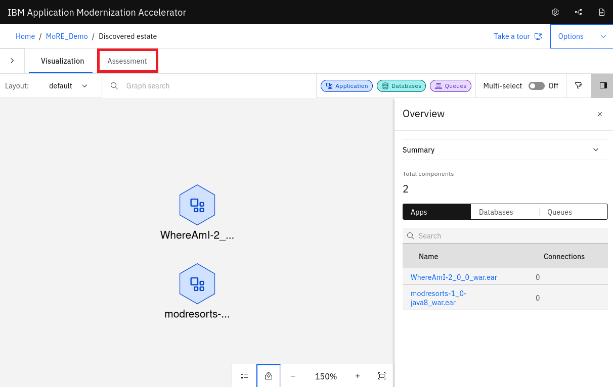</kbd>

	Click on the **Assessment** tab.

4. You can see the assessment for the different target applications. Select as target Liberty administered from WebSphere (MoRE) and you can see, that the application can be migrated to MoRE but has some issues that must be fixed.

	<kbd></kbd>

	Click on the WhereAmI application to get more insight about the issues

5. As you can see, Click on the WhereAmI application to get more insight about the issues

	<kbd></kbd>

	<kbd></kbd>

	<kbd></kbd>

5. Generate and download the **migration plan** so that you can re-use it in AMA Dev Tools

	<kbd></kbd>

## Demo how to use the AMA Dev Tools to apply automated fixes

1. In a terminal window, switch to the WhereAmI directory and open VS Code

		cd WhereAmI_JavaEE_Project/WhereAmI
		code .

2. Change in the pom.xml file the version from 2.0.0 to 2.0.1

3. Start the AMA Dev Tool modernization wizard for target Liberty

	<kbd></kbd>

4. Upload the AMA generated migration plan into AMA Dev Tools

	<kbd></kbd>

	Hint: As backup, you can find a migration plan also at: 

		~/Student/labs/WhereAmI_MoRE_Demo_assets/AMA_Migrationplan/

5. Add the server.xml file from the migration plan to the project. The server.xml was generated by AMA and helps to test the application in development on Liberty.

	<kbd></kbd>

6. Take a look at the identified modernization issues which are mainly in the are ap automated fixes

	<kbd></kbd>

	Click on **Run automated fixes** to fix those issues.

7. Click on Rebuild and refresh and you will see that also the self-directed issue has been resolved.

	<kbd></kbd>

## Set up the managed Liberty cluster

1. Create a managed Liberty cluster named managedLibertyCluster1

	<kbd></kbd>

	<kbd></kbd>

2. Create the first cluster member on the first node based on the managed Liberty server template.
	
	<kbd></kbd>

3. Add another cluster member, this time on the sevcond node.

	<kbd></kbd>

	<kbd></kbd>

4. Review the summary to make sure the servers are placed correctly

	<kbd></kbd>

5. Before saving the cluster, take a look at the wsadmin script.

	<kbd></kbd>

6. Save the settings

	<kbd></kbd>

7. CLick on the cluster name

	<kbd></kbd>

8. Review the configuration

	<kbd></kbd>

9. Take a look at the local topology.

	<kbd></kbd>

10. Review the ports and add missing HTTP ports to the virtual hosts

	<kbd></kbd>

	<kbd></kbd>

	<kbd></kbd>

## Deploy the application

1. Select the updated WhereAmI application (which has the version 2.0.1) and select Liberty as target runtime

	<kbd></kbd>

2. Choose the Fast Path deployment and leave the defaults for the name

	<kbd></kbd>

	<kbd></kbd>

3. Map the application to the Liberty cluster and the IBM HTTP Server

	<kbd></kbd>

4. Leave the default host

	<kbd></kbd>

5. Change the context root to **/liberty**

	<kbd></kbd>

6. Review the summary

	<kbd></kbd>

7. Take a look at the wsadmin script

	<kbd></kbd>

8. Finally save the application. It should be listed as stopped.

	<kbd></kbd>

## Start the cluster and test the application

1. Start the cluster

	<kbd></kbd>

2. Review the wsadmin script

	<kbd></kbd>

3. Access the application via IBM HTTP Server

	<kbd></kbd>

4. Reload the page and you should see that it switches been both Liberty instances.

	<kbd></kbd>

**This concludes the demo**
You should have seen how easy it can be to migrate an application from traditional WAS to managed Liberty and that you could use the same operational model in managed Liberty.

## Cleanup

### Clean up AMA

1. In AMA, delete the AMA workspace **MoRE_Demo**

2. Stop AMA

		cd ~/application-modernization-accelerator-local-4.3.0/
		scripts/stopLocal.sh 
		
3. Remove the data collector 

		rm -rf ~/Downloads/DiscoveryTool-Linux_MoRE_Demo.tgz
		rm -rf ~/Downloads/DiscoveryTool-Linux_MoRE_Demo
		rm -rf ~/Downloads/WhereAmI-2_0_0_war.ear_migrationPlan.zip

### Cleanup WebSphere

1. Uninstall the WhereAmI application

		~/IBM/WebSphere/AppServer/profiles/Dmgr01/bin/wsadmin.sh -lang jython -user techzone -password IBMDem0s! -f ~/Student/labs/WhereAmI_MoRE_Demo_assets/setupScripts/tWASCluster_WhereAmI_uninstall.py 

2. Delete the tWAS cluster called tWASCluster1 and the two members (tWASMember1, tWASMember2).

		~/IBM/WebSphere/AppServer/profiles/Dmgr01/bin/wsadmin.sh -lang jython -user techzone -password IBMDem0s! -f ~/Student/labs/WhereAmI_MoRE_Demo_assets/setupScripts/tWASCluster_delete.py 

3. Stop the IBM HTTP Server via command

		/home/techzone/IBM/HTTPServer/bin/apachectl stop

4. Stop the Dmgr and the two Node agents

		~/IBM/WebSphere/AppServer/profiles/AppSrv02/bin/stopNode.sh
		~/IBM/WebSphere/AppServer/profiles/AppSrv01/bin/stopNode.sh
		~/IBM/WebSphere/AppServer/profiles/Dmgr01/bin/stopManager.sh 

### Remove the lab assests
1. Close VS Code

2. Remove the project directory

		cd ~
		rm -rf ~/Student/labs

